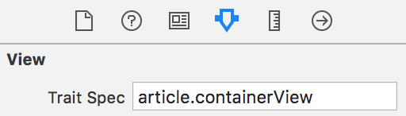

# Traits - Modify your native iOS app properties in real time.

[](https://circleci.com/gh/krzysztofzablocki/Traits)
[](https://codecov.io/gh/krzysztofzablocki/Traits)
[](http://cocoapods.org/pods/Traits)
[](http://cocoapods.org/pods/Traits)
[](http://cocoapods.org/pods/Traits)

## What are Traits?
_**Traits**_ allows you to modify the design and behavior of native iOS apps without having to restart them, even across the globe.

Wouldn't it be great if we could adjust designs of our native apps without having to sit back to Xcode, change code, recompile and navigate back to the screen we were at?

**Traits** is a library that provides you the ability to change many properties of your apps (not only design) without having to recompile the application, even via network across the globe.

Using it offers many benefits:

- Immediate feedback
- Ability to update running applications remotely
- Requires almost no code changes in your app
- Both Code and Interface Builder designs are supported
- Can tweak more than just UI
- Fully tested
- Supports [code injection and real-time programming](http://johnholdsworth.com/injection.html)


[Article describing design and implementation details of this tool](http://merowing.info/2017/01/how-hard-would-it-be-to-adjust-your-ios-app-in-real-time/)

## Usage

#### 1. Add the library into your project
#### 2. Assign proper view identifiers either via code:
```swift
view.traitSpec = "article.containerView"
```

or via interface builder:



#### 3. [Optional] If you want live-reloading:

While running on simulator you can observe file on your desktop:
```swift
TraitsProvider.setupDesktopDaemon()
```

While running on device, you can observe remote URL:
```swift
TraitsProvider.setupRemoteDaemon(url: myFileURL)
```

## Extending

`Traits` supports extending the library in real-time, without even having to recompile your project and **without unsigning your Xcode 8**.

Just install [Injection app](http://johnholdsworth.com/injection.html) and code away:
<br/>


Adding new `Trait` that is specific to your project is really simple:

1. Create a new subclass of `Trait`
2. Declares the target types that are supported.
3. Provide `apply` function that returns a reversal closure
4. Declare data mapping using `ObjectMapper`
5. Compile. (or code inject as we support that as well)

```swift
final public class Constraint: Trait {
    private(set) var constant: CGFloat?

    open override class var restrictedTypes: [AnyClass]? { return [NSLayoutConstraint.self] }

    open override func apply(to target: Trait.Target, remove: inout RemoveClosure) throws {
        let target = target as! NSLayoutConstraint

        remove = { [weak target, constant = target.constant] in
            guard let target = target else { return }
            target.constant = constant
        }

        if let constant = constant {
            target.constant = constant
        }
    }

    public init(constant: CGFloat) {
        super.init()
        self.constant = constant
    }

    public required init?(map: Map) {
        super.init(map: map)
    }

    open override func mapping(map: Map) {
        super.mapping(map: map)
        constant <- map["constant"]
    }
}
```


## Requirements
This library requires a deployment target of iOS 8.0 or greater.

## Installation

Traits is available through [CocoaPods](http://cocoapods.org).

To install it, simply add the following line to your Podfile:

```ruby
pod "Traits"
```

## Origin

Created by [Krzysztof Zabłocki](krzysztof.zablocki@nytimes.com) ([twitter](http://twitter.com/merowing_) | [website](http://merowing.info)) during Maker Week at [The New York Times](http://www.nytimes.com)

[Article describing design and implementation details of this tool](http://merowing.info/2017/01/how-hard-would-it-be-to-adjust-your-ios-app-in-real-time/)

## Contributing

Contributions to Traits are welcomed and encouraged! Please see the [Contributing guide](https://github.com/krzysztofzablocki/Traits/blob/master/CONTRIBUTING.md).

[A list of contributors is available through GitHub.](https://github.com/krzysztofzablocki/Traits/graphs/contributors)

To give clarity of what is expected of our members, we adopted the code of conduct defined by the Contributor Covenant. This document is used across many open source communities, and we think it articulates my values well. For more, see the [Code of Conduct](https://github.com/krzysztofzablocki/Traits/blob/master/CODE_OF_CONDUCT.md).

## License

Traits is available under the MIT license. See [LICENSE](https://github.com/krzysztofzablocki/Traits/blob/master/LICENSE.md) for more information.

## Attributions

This tool is powered by
- [Object Mapper](https://github.com/Hearst-DD/ObjectMapper)

Thank you goes to:
- Veronique Brossier and Chrys Wu from NYT because they helped me clarify expectations for this library.

## Other Libraries / Tools

Make sure to check my other libraries and tools, especially:
- [Sourcery](https://github.com/krzysztofzablocki/Sourcery) - Tool that introduces type-safe meta-programming for swift, allowing you to avoid boilerplate code.
- [KZPlayground](https://github.com/krzysztofzablocki/KZPlayground) - Powerful playgrounds for Swift and Objective-C.
- [KZFileWatchers](https://github.com/krzysztofzablocki/KZFileWatchers) - Daemon for observing local and remote file changes, used for building other developer tools (Traits uses it)

You can [follow me on twitter][1] for news/updates about other projects I am creating.

 [1]: http://twitter.com/merowing_
